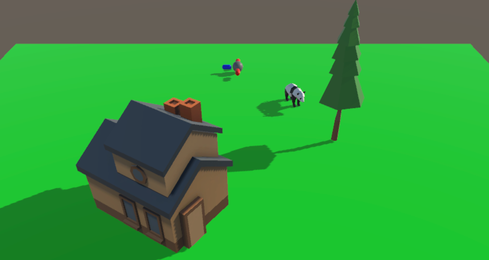

# deepscene-frontend-unity

  

<h3 align="center">DeepScene Unity</h3>

---

 A playground to train and test our Graph Neural Network, DeepScene, which aims to predict placement and animation from input text by producing Scene Graphs.
      

Note: This assumes you have unity installed
